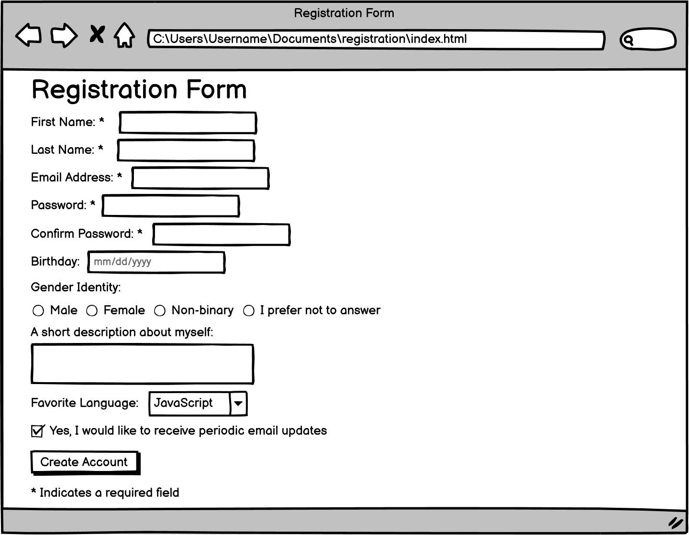

# wf_registration_form

## solution branch

## Objectives
- Practice recreating the staple of many websites, a Registration Form
- Practice using `form`, `input`, `select` and `textarea`

Our HTML should contain the following tags:

- `<input type="text">`
- `<input type="password">`
- `<input type="date">`
- `<input type="radio">`
- `<input type="checkbox">`
- `<input type="submit">`
- `<textarea>`
- `<select>`